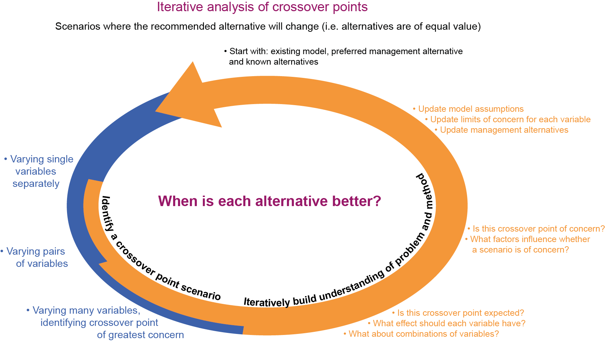

# Crossover point scenarios

> Stress testing of management recommendations, by iterative reflection on crossover point scenarios

Quick link to [tools](#tools)

## What is a crossover point scenario?

* Suppose you are comparing management alternatives. Crossover point scenarios are combinations of values of variables where cost-benefit or other trade-off analysis frameworks show two alternatives to be of equal value. 
* There is a crossover at this point between which of the two management alternatives has greater value than the other. The set of crossover points therefore demarcates a boundary at which the analysis crosses over from favouring one alternative to the other. 

* If a crossover point scenario occurs, a recommended management alternative may no longer be worthwhile. Scenarios describing crossover points are therefore particularly suitable to help test the robustness of recommendations.

* Other similar concepts include break-even points, switch-over points, indifference curves, isoquant curves

## What does the stress-testing method involve?

* The analyst defines management alternatives to test, competing alternatives, a model (e.g. cost-benefit analysis), and preliminary limits of concern for each uncertain variable in the model - maximum and minimum values beyond which a crossover point would be of no concern.

* This tools provided from this site are used iteratively to identify crossover points scenarios while varying one, two or many variables. 

* The resulting scenarios are intended to help prompt changes to model assumptions, management alternatives and the limits of concern, after which the analysis can be run again. The scenarios help iteratively build understanding of the problem at hand.

## When is this method applicable?

This use of crossover points is applicable to a class of problems  we describe here as **“reflective stress-testing of a model-based recommendation.”** The emphasis is on supporting the analyst’s iterative reflection to enable learning about robustness of recommendations despite poor *a priori* knowledge about uncertainty. The problem is characterised by:

*	An existing analysis, by which management alternatives can be compared according to clear quantitative criteria, based on best available information
*	An existing preferred alternative select using that model, and known competing alternatives
*	Need to determine robustness of the recommended alternative in the presence of uncertainty 
*	Uncertain probability distribution and bounds, precluding uncertainty quantification
*	Reflection on scenarios can help to prompt revision of alternatives, criteria, and understanding of uncertainty, making a posteriori use of tacit or previously unconsolidated knowledge
*	Iteration prompted by reflection is possible, notably because the model can easily be interactively modified and nearly instantaneously re-run. An analyst may however be willing to tolerate short delays between iterations.

##  Tools

### Excel add-in
* xlam file ([CrossoverAddon.xlam](./CrossoverAddon.xlam))
* [Howto](./CrossoverAddon howto.docx) for use of the add-in
* Demo using comparison of water footprints of two diets ([change in diet footprint crossover example.xlsx](./change in diet footprint crossover example.xlsx))

### Web tool

* Web-based spreadsheet-type tool ([link](http://josephguillaume.ocpu.io/breakdown/www/)).
* [Code](https://github.com/josephguillaume/breakdown) for the tool

### Other implementations

* A version of the functions in R was written for an analysis of managed aquifer recharge as a water storage solution ([Archived code](http://dx.doi.org/10.5281/zenodo.11704)

Arshad, Muhammad, Joseph Guillaume, and Andrew Ross. 2014. “Assessing the Feasibility of Managed Aquifer Recharge for Irrigation under Uncertainty.” Water 6 (9). Multidisciplinary Digital Publishing Institute: 2748–69. doi:10.3390/w6092748

# Related methods

### MORE/POMORE

These methods similarly identify crossover points, primarily for the purpose of ranking uncertain variables in order of importance. They refer to crossover points as points of rank equivalence, and the **rank equivalence boundary**.

* Ravalico, Jakin K., Holger R. Maier, and Graeme C. Dandy. 2009. “Sensitivity Analysis for Decision-Making Using the MORE method—A Pareto Approach.” Reliability Engineering & System Safety 94 (7): 1229–37. doi:10.1016/j.ress.2009.01.009

* Ravalico, J.K., G.C. Dandy, and H.R. Maier. 2010. “Management Option Rank Equivalence (MORE) – A New Method of Sensitivity Analysis for Decision-Making.” Environmental Modelling & Software 25 (2): 171–81. doi:10.1016/j.envsoft.2009.06.012

* Hyde, K.M., and H.R. Maier. 2006. “Distance-Based and Stochastic Uncertainty Analysis for Multi-Criteria Decision Analysis in Excel Using Visual Basic for Applications.” Environmental Modelling & Software 21 (12): 1695–1710. doi:10.1016/j.envsoft.2005.08.004

* Hyde, K M, H R Maier, and C B Colby. 2005. “A Distance-Based Uncertainty Analysis Approach to Multi-Criteria Decision Analysis for Water Resource Decision Making.” Journal of Environmental Management 77 (4): 278–90. doi:10.1016/j.jenvman.2005.06.011

### Scenario discovery and decision scaling

As the complement of crossover points, these approaches can be used to identify the ranges of variables for which one alternative is better than the other.

* Bryant, Benjamin P., and Robert J. Lempert. 2010. “Thinking inside the Box: A Participatory, Computer-Assisted Approach to Scenario Discovery.” Technological Forecasting and Social Change 77 (1): 34–49. doi:10.1016/j.techfore.2009.08.002

* Brown, Casey, Yonas Ghile, Mikaela Laverty, and Ke Li. 2012. “Decision Scaling: Linking Bottom-up Vulnerability Analysis with Climate Projections in the Water Sector.” Water Resources Research 48 (9): n/a – n/a. doi:10.1029/2011WR011212